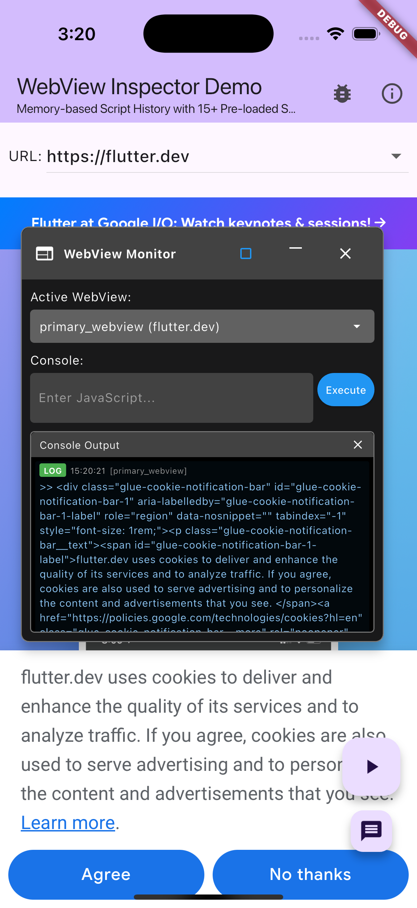
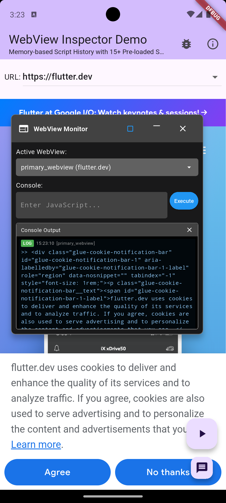

# InAppWebView Inspector 🔍

[](https://pub.dev/packages/inappwebview_inspector)
[](https://opensource.org/licenses/MIT)

A powerful WebView inspector and debugging tool for `flutter_inappwebview`. Provides real-time console monitoring, JavaScript execution, and script history management with a draggable overlay interface.

> 🤖 **Developed with Claude**: This Flutter library was developed using **Vibe coding** methodology in collaboration with Claude AI, showcasing the power of AI-assisted development and human-AI collaborative programming.

## 🌍 Multi-language Documentation

- **English** | [한국어](README_ko.md) | [日本語](README_ja.md)

## ✨ Features

### 🖥️ **Real-time Console Monitoring**
- **Live Console Output**: Monitor all JavaScript console messages (`log`, `warn`, `error`, `debug`) in real-time
- **Color-coded Messages**: Different colors for different log levels for easy identification
- **Timestamp Display**: Each message includes precise timestamp information
- **Multi-line Support**: Full support for long messages and multi-line output
- **Clean Interface**: Removed unnecessary labels for streamlined debugging experience

### 🚀 **Enhanced JavaScript Execution**
- **Interactive Console**: Execute JavaScript code directly in your WebView with intelligent result handling
- **Smart DOM Object Processing**: 
  - `document.querySelector("h1")` → Shows element details (tag, id, class, text content)
  - `document.querySelectorAll("p")` → Lists all matching elements with comprehensive information
  - `document.body.classList` → Automatically converts to readable array format
  - Functions and complex objects → Displays in developer-friendly format
- **Enhanced Error Handling**: Comprehensive error messages with helpful suggestions for common DOM operations
- **Unicode & Base64 Support**: Advanced script encoding options for complex scenarios

### 📚 **Intelligent Script History System**
- **Pre-loaded Scripts**: 15+ commonly used JavaScript snippets ready to use immediately
- **Frequency-based Sorting**: Most-used scripts automatically appear first
- **Memory-based Storage**: Fast, lightweight history management without file I/O
- **Smart Suggestions**: Context-aware script recommendations
- **Usage Tracking**: Automatically tracks and prioritizes frequently used scripts

### 🎯 **Multi-WebView Management**
- **Multiple WebView Support**: Handle unlimited WebViews in a single application
- **Easy Switching**: Quick dropdown to switch between registered WebViews
- **Individual Monitoring**: Each WebView maintains its own console and execution context
- **Automatic Registration**: Simple API to register and manage WebView instances

### 🌍 **Comprehensive Internationalization**
- **8 Languages Supported**: English, Korean, Japanese, Spanish, French, German, Chinese (Simplified), Portuguese
- **Auto-detection**: Automatic language detection from system locale
- **Easy Localization**: Simple API to set preferred language
- **Consistent UI**: All interface elements properly localized

### 🎨 **Advanced User Interface**
- **Draggable Overlay**: Move the inspector anywhere on screen with smooth drag interactions
- **Resizable Interface**: Switch between compact and maximized modes for different use cases
- **SafeArea Aware**: Automatically adjusts to device screen constraints and notches
- **Stack-based Architecture**: Stable popup system without overlay conflicts
- **Clean Design**: Minimal, developer-focused interface optimized for productivity

## Installation

Add this to your package's `pubspec.yaml` file:

```yaml
dependencies:
  inappwebview_inspector: ^0.1.0
  flutter_inappwebview: ^6.0.0
```

Then run:

```bash
$ flutter pub get
```

## 🚀 Quick Start

### 1. Initialize the Inspector

Add this to your `main()` function:

```dart
import 'package:inappwebview_inspector/inappwebview_inspector.dart';

void main() {
  // Initialize for development with enhanced features
  InAppWebViewInspector.initializeDevelopment(
    enableScriptHistory: true,
    maxScriptHistoryCount: 25,
    localizations: InAppWebViewInspectorLocalizations.english, // Change as needed
    onScriptExecuted: (script, webViewId) {
      print('Executed: $script on $webViewId');
    },
    onConsoleLog: (log) {
      print('Console [${log.levelText}]: ${log.message}');
    },
  );
  
  runApp(MyApp());
}
```

### 2. Add Inspector Widget to Your App

**⚠️ Important**: The inspector widget must be placed inside a `Stack` within your `Scaffold` body:

```dart
import 'package:flutter/material.dart';
import 'package:flutter_inappwebview/flutter_inappwebview.dart';
import 'package:inappwebview_inspector/inappwebview_inspector.dart';

class MyWebViewPage extends StatefulWidget {
  @override
  _MyWebViewPageState createState() => _MyWebViewPageState();
}

class _MyWebViewPageState extends State<MyWebViewPage> {
  InAppWebViewController? webViewController;
  final String webViewId = 'main_webview';

  @override
  Widget build(BuildContext context) {
    return Scaffold(
      appBar: AppBar(
        title: Text('WebView with Inspector'),
        actions: [
          // Toggle button for inspector
          IconButton(
            icon: Icon(Icons.bug_report),
            onPressed: InAppWebViewInspector.toggle,
            tooltip: 'Toggle Inspector',
          ),
        ],
      ),
      body: Stack(  // ⚠️ Must use Stack here
        children: [
          // Your main WebView
          InAppWebView(
            initialUrlRequest: URLRequest(
              url: WebUri('https://flutter.dev'),
            ),
            onWebViewCreated: (controller) {
              webViewController = controller;
              
              // Register WebView with inspector
              InAppWebViewInspector.registerWebView(
                webViewId,
                controller,
                'https://flutter.dev',
              );
            },
            onLoadStop: (controller, url) {
              // Update URL in inspector when navigation occurs
              if (url != null) {
                InAppWebViewInspector.updateWebViewUrl(
                  webViewId,
                  url.toString(),
                );
              }
            },
            onConsoleMessage: (controller, consoleMessage) {
              // Forward console messages to inspector
              InAppWebViewInspector.addConsoleLog(
                webViewId,
                consoleMessage,
              );
            },
            initialSettings: InAppWebViewSettings(
              isInspectable: true, // Enable debugging
              javaScriptEnabled: true,
              domStorageEnabled: true,
            ),
          ),
          
          // Inspector overlay widget - MUST be inside Stack
          const InAppWebViewInspectorWidget(),
        ],
      ),
    );
  }

  @override
  void dispose() {
    // Clean up when page is disposed
    InAppWebViewInspector.unregisterWebView(webViewId);
    super.dispose();
  }
}
```

### 3. Control Inspector Visibility

```dart
// Show/hide inspector
InAppWebViewInspector.show();
InAppWebViewInspector.hide();
InAppWebViewInspector.toggle();

// Enable/disable inspector
InAppWebViewInspector.enable();
InAppWebViewInspector.disable();

// Check status
bool isVisible = InAppWebViewInspector.isVisible;
bool isEnabled = InAppWebViewInspector.isEnabled;
```

## ⚙️ Configuration Options

### Development Mode (Recommended for Debug Builds)

```dart
InAppWebViewInspector.initializeDevelopment(
  enableScriptHistory: true,
  maxScriptHistoryCount: 25,
  maxConsoleLogCount: 500,
  localizations: InAppWebViewInspectorLocalizations.english,
  onScriptExecuted: (script, webViewId) {
    print('Script executed on $webViewId: $script');
  },
  onConsoleLog: (log) {
    print('Console [${log.levelText}]: ${log.message}');
  },
);
```

### Production Mode (Minimal Impact)

```dart
InAppWebViewInspector.initializeProduction(
  maxConsoleLogCount: 50,
  enableAutoResultLogging: false,
  enableScriptHistory: false,
  localizations: InAppWebViewInspectorLocalizations.english,
);
```

### Advanced Custom Configuration

```dart
InAppWebViewInspector.initializeWithConfig(
  InAppWebViewInspectorConfig(
    debugMode: true,
    maxConsoleLogCount: 1000,
    enableAutoResultLogging: true,
    enableUnicodeQuoteNormalization: true,
    enableBase64ScriptEncoding: true,
    enableScriptHistory: true,
    maxScriptHistoryCount: 30,
    localizations: InAppWebViewInspectorLocalizations.korean, // Multi-language support
    onScriptExecuted: (script, webViewId) {
      // Custom script execution callback
      analytics.logEvent('script_executed', {'webview_id': webViewId});
    },
    onConsoleLog: (log) {
      // Custom console logging
      if (log.level == ConsoleMessageLevel.ERROR) {
        crashlytics.recordError(log.message, null);
      }
    },
    onError: (error, webViewId) {
      // Error handling callback
      print('Inspector error in $webViewId: $error');
    },
  ),
);
```

### Language Configuration

```dart
// Available localizations
InAppWebViewInspectorLocalizations.english
InAppWebViewInspectorLocalizations.korean
InAppWebViewInspectorLocalizations.japanese
InAppWebViewInspectorLocalizations.spanish
InAppWebViewInspectorLocalizations.french
InAppWebViewInspectorLocalizations.german
InAppWebViewInspectorLocalizations.chineseSimplified
InAppWebViewInspectorLocalizations.portuguese

// Auto-detect from system locale
final localization = InAppWebViewInspectorLocalizations.getByLanguageCode(
  Localizations.localeOf(context).languageCode
);
```

## 🎯 Advanced Usage Examples

### Multiple WebViews Management

```dart
class MultiWebViewExample extends StatefulWidget {
  @override
  _MultiWebViewExampleState createState() => _MultiWebViewExampleState();
}

class _MultiWebViewExampleState extends State<MultiWebViewExample> {
  @override
  Widget build(BuildContext context) {
    return Scaffold(
      body: Stack(
        children: [
          Column(
            children: [
              // First WebView
              Expanded(
                child: InAppWebView(
                  onWebViewCreated: (controller) {
                    InAppWebViewInspector.registerWebView(
                      'webview_1',
                      controller,
                      'https://flutter.dev',
                    );
                  },
                  onConsoleMessage: (controller, consoleMessage) {
                    InAppWebViewInspector.addConsoleLog('webview_1', consoleMessage);
                  },
                  initialSettings: InAppWebViewSettings(
                    isInspectable: true,
                    javaScriptEnabled: true,
                  ),
                ),
              ),
              // Second WebView  
              Expanded(
                child: InAppWebView(
                  onWebViewCreated: (controller) {
                    InAppWebViewInspector.registerWebView(
                      'webview_2', 
                      controller,
                      'https://dart.dev',
                    );
                  },
                  onConsoleMessage: (controller, consoleMessage) {
                    InAppWebViewInspector.addConsoleLog('webview_2', consoleMessage);
                  },
                  initialSettings: InAppWebViewSettings(
                    isInspectable: true,
                    javaScriptEnabled: true,
                  ),
                ),
              ),
            ],
          ),
          
          // Single inspector manages both WebViews
          const InAppWebViewInspectorWidget(),
        ],
      ),
    );
  }
}
```

### Custom Console Messages

```dart
// Add custom messages from Flutter
InAppWebViewInspector.instance.addCustomConsoleLog(
  InAppWebViewInspectorConsoleMessage(
    webViewId: 'main',
    level: ConsoleMessageLevel.WARNING,
    message: 'Custom warning from Flutter side',
    source: null, // Clean interface without source labels
    line: null,
    timestamp: DateTime.now(),
  ),
);

// Add development debug messages
InAppWebViewInspector.instance.addCustomConsoleLog(
  InAppWebViewInspectorConsoleMessage(
    webViewId: 'main',
    level: ConsoleMessageLevel.LOG,
    message: 'Flutter lifecycle: App resumed',
    source: null,
    line: null,
    timestamp: DateTime.now(),
  ),
);
```

### Programmatic Script Execution

```dart
// Execute custom scripts programmatically
void executeCustomScripts() {
  final inspector = InAppWebViewInspector.instance;
  
  // Simple value retrieval
  inspector.executeScript('document.title');
  
  // Complex DOM operations  
  inspector.executeScript('''
    const links = document.querySelectorAll('a');
    Array.from(links).map(link => ({
      text: link.textContent?.trim(),
      href: link.href,
      className: link.className
    }));
  ''');
  
  // Error handling example
  inspector.executeScript('''
    try {
      const result = performComplexOperation();
      console.log('Operation successful:', result);
      return result;
    } catch (error) {
      console.error('Operation failed:', error.message);
      return { error: error.message, stack: error.stack };
    }
  ''');
}
```

## 🛠️ Pre-loaded Utility Scripts

The inspector comes with 15+ ready-to-use JavaScript snippets:

### Page Information
- `document.title` - Get current page title
- `window.location.href` - Get current URL
- `document.readyState` - Check page load state
- `document.getElementsByTagName("*").length` - Count all elements

### DOM Manipulation  
- `document.querySelector("selector")` - Find single element with details
- `document.querySelectorAll("selector")` - Find all matching elements
- `document.body.innerHTML` - Get page HTML content
- `document.cookie` - View all cookies

### Browser & Performance
- `navigator.userAgent` - Get browser information
- `window.innerWidth + "x" + window.innerHeight` - Get viewport size
- `performance.now()` - High-precision timing
- `Object.keys(window)` - List global variables

### Storage Access
- `localStorage.getItem("key")` - Access local storage
- `sessionStorage.getItem("key")` - Access session storage

### Development Utilities
- `console.log("Hello World");` - Basic console logging

## 📸 Screenshots

### iOS Inspector Interface


*The inspector running on iOS showing the draggable overlay interface*

### Android Inspector Interface  


*The inspector running on Android with the same powerful debugging features*

### Key Interface Features Shown:
- **🖱️ Draggable Overlay**: Move the inspector anywhere on screen
- **📱 Responsive Design**: Adapts to different screen sizes and orientations  
- **🎯 WebView Selector**: Dropdown to switch between multiple WebViews
- **⌨️ Interactive Console**: JavaScript input field with history dropdown
- **📋 Real-time Logs**: Color-coded console output with timestamps
- **🔄 Resizable Interface**: Toggle between compact and maximized modes

## ⚠️ Important Implementation Notes

### Widget Placement Requirements

The `InAppWebViewInspectorWidget` **must** be placed correctly to avoid runtime errors:

✅ **Correct**: Inside Scaffold body Stack
```dart
Scaffold(
  body: Stack(
    children: [
      YourMainContent(),
      const InAppWebViewInspectorWidget(), // ✅ Correct placement
    ],
  ),
)
```

❌ **Incorrect**: Inside MaterialApp builder  
```dart
MaterialApp(
  builder: (context, child) => Stack(
    children: [
      child!,
      const InAppWebViewInspectorWidget(), // ❌ Will cause overlay errors
    ],
  ),
)
```

### Common Issues & Solutions

1. **"No Overlay widget found"**: Move the inspector widget from MaterialApp.builder to inside a Scaffold Stack
2. **Inspector not showing**: Ensure you've called `InAppWebViewInspector.enable()` after registering a WebView

### Development vs Production

**Development Build:**
```dart
InAppWebViewInspector.initializeDevelopment(
  enableScriptHistory: true,
  maxConsoleLogCount: 500,
);
```

**Production Build:**
```dart
InAppWebViewInspector.initializeProduction(
  maxConsoleLogCount: 50,
  enableScriptHistory: false,
);
```

## 📱 Example App

The [example app](example/) demonstrates:

- ✅ Complete WebView integration with inspector
- ✅ Multi-language support demonstration  
- ✅ Pre-loaded script usage
- ✅ Enhanced DOM object handling
- ✅ Multiple WebView management
- ✅ Custom script execution examples

Run the example:

```bash
cd example && flutter run
```

## 📋 Requirements

- **Flutter**: >= 3.0.0
- **Dart**: >= 3.0.6  
- **flutter_inappwebview**: >= 6.0.0

## 🌐 Platform Support

| Platform | Status | Notes |
|----------|---------|--------|
| Android | ✅ Full Support | All features available |
| iOS | ✅ Full Support | All features available |

## 🤝 Contributing

This project demonstrates the power of **AI-assisted development** using Claude and **Vibe coding** methodology. Contributions are welcome!

### How to Contribute

1. **Fork** the repository
2. **Create** your feature branch (`git checkout -b feature/amazing-feature`)
3. **Test** your changes thoroughly 
4. **Commit** your changes (`git commit -m 'Add amazing feature'`)
5. **Push** to the branch (`git push origin feature/amazing-feature`)
6. **Open** a Pull Request

### Development Setup

```bash
# Clone the repository
git clone https://github.com/baccusf/inappwebview_inspector.git
cd inappwebview_inspector

# Install dependencies  
flutter pub get

# Run tests
flutter test

# Run example
cd example && flutter run
```

## 📄 License

This project is licensed under the MIT License - see the [LICENSE](LICENSE) file for details.

## 🙏 Acknowledgments

- **🤖 Claude AI**: This library was developed through AI-human collaborative programming using Claude
- **⚡ Vibe Coding**: Demonstrated the effectiveness of AI-assisted development methodology  
- **💙 Flutter Community**: For providing the amazing Flutter framework
- **🌐 flutter_inappwebview**: For the excellent WebView foundation

## 📞 Support & Community

- **🐛 Issues**: [Report bugs and issues](https://github.com/baccusf/inappwebview_inspector/issues)
- **💡 Features**: [Request new features](https://github.com/baccusf/inappwebview_inspector/issues/new?template=feature_request.md)  
- **📖 Documentation**: Check the comprehensive [CLAUDE.md](CLAUDE.md) for development guidance
- **💬 Discussions**: [Join community discussions](https://github.com/baccusf/inappwebview_inspector/discussions)

## 🔗 Related Links

- **📦 pub.dev**: [Package on pub.dev](https://pub.dev/packages/inappwebview_inspector)
- **🌐 Repository**: [GitHub Repository](https://github.com/baccusf/inappwebview_inspector)
- **📚 flutter_inappwebview**: [Core WebView package](https://pub.dev/packages/flutter_inappwebview)
- **🤖 Claude**: [Learn more about Claude AI](https://claude.ai)

---

**Happy debugging with AI-assisted development!** 🐛✨🤖