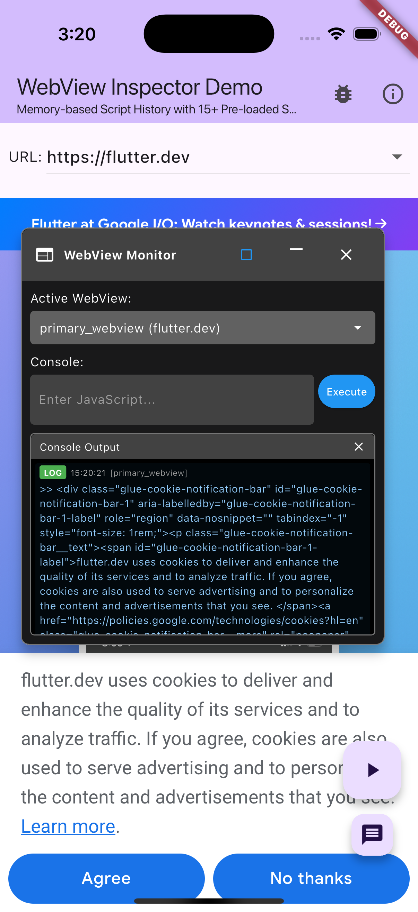

# InAppWebView Inspector 🔍

[](https://pub.dev/packages/inappwebview_inspector)
[](https://opensource.org/licenses/MIT)

`flutter_inappwebview`를 위한 강력한 웹뷰 디버깅 및 검사 도구입니다. 실시간 콘솔 모니터링, JavaScript 실행, 스크립트 히스토리 관리 기능을 드래그 가능한 오버레이 인터페이스로 제공합니다.

> 🤖 **Claude와 함께 개발**: 이 Flutter 라이브러리는 Claude AI와 **바이브 코딩(Vibe coding)** 방법론을 사용한 협업을 통해 개발되었으며, AI 지원 개발과 인간-AI 협력 프로그래밍의 힘을 보여줍니다.

## 🌍 언어별 문서

- [English](README.md) | **한국어** | [日本語](README_ja.md)

## ✨ 주요 기능

### 🖥️ **실시간 콘솔 모니터링**
- **라이브 콘솔 출력**: 모든 JavaScript 콘솔 메시지(`log`, `warn`, `error`, `debug`)를 실시간으로 모니터링
- **색상 구분 메시지**: 로그 레벨에 따른 색상 구분으로 쉬운 식별 가능
- **타임스탬프 표시**: 각 메시지에 정확한 타임스탬프 정보 포함
- **다중 라인 지원**: 긴 메시지와 다중 라인 출력 완벽 지원
- **깔끔한 인터페이스**: 불필요한 라벨 제거로 간소화된 디버깅 환경

### 🚀 **향상된 JavaScript 실행**
- **대화형 콘솔**: 지능적인 결과 처리와 함께 WebView에서 직접 JavaScript 코드 실행
- **스마트 DOM 객체 처리**: 
  - `document.querySelector("h1")` → 요소 상세 정보 표시 (태그, id, 클래스, 텍스트 내용)
  - `document.querySelectorAll("p")` → 일치하는 모든 요소의 종합적인 정보 나열
  - `document.body.classList` → 자동으로 읽기 가능한 배열 형식으로 변환
  - 함수 및 복잡한 객체 → 개발자 친화적인 형식으로 표시
- **향상된 오류 처리**: 일반적인 DOM 작업에 대한 유용한 제안이 포함된 포괄적인 오류 메시지
- **Unicode 및 Base64 지원**: 복잡한 시나리오를 위한 고급 스크립트 인코딩 옵션

### 📚 **지능형 스크립트 히스토리 시스템**
- **사전 로드된 스크립트**: 즉시 사용 가능한 15개 이상의 일반적으로 사용되는 JavaScript 스니펫
- **빈도 기반 정렬**: 가장 많이 사용된 스크립트가 자동으로 맨 위에 표시
- **메모리 기반 저장**: 파일 I/O 없는 빠르고 가벼운 히스토리 관리
- **스마트 제안**: 상황에 맞는 스크립트 추천
- **사용량 추적**: 자주 사용하는 스크립트를 자동으로 추적하고 우선순위 부여

### 🎯 **다중 WebView 관리**
- **다중 WebView 지원**: 단일 애플리케이션에서 무제한 WebView 처리
- **쉬운 전환**: 등록된 WebView 간 빠른 드롭다운 전환
- **개별 모니터링**: 각 WebView가 고유한 콘솔 및 실행 컨텍스트 유지
- **자동 등록**: WebView 인스턴스 등록 및 관리를 위한 간단한 API

### 🌍 **포괄적인 국제화**
- **8개 언어 지원**: 영어, 한국어, 일본어, 스페인어, 프랑스어, 독일어, 중국어(간체), 포르투갈어
- **자동 감지**: 시스템 로케일에서 자동 언어 감지
- **쉬운 지역화**: 선호 언어 설정을 위한 간단한 API
- **일관된 UI**: 모든 인터페이스 요소의 적절한 지역화

### 🎨 **고급 사용자 인터페이스**
- **드래그 가능한 오버레이**: 부드러운 드래그 상호작용으로 화면 어디든 검사기 이동 가능
- **크기 조절 가능한 인터페이스**: 다양한 사용 사례를 위한 컴팩트 및 최대화 모드 전환
- **SafeArea 인식**: 기기 화면 제약 및 노치에 자동 조정
- **스택 기반 아키텍처**: 오버레이 충돌 없는 안정적인 팝업 시스템
- **깔끔한 디자인**: 생산성을 위해 최적화된 최소한의 개발자 중심 인터페이스

## 📦 설치

`pubspec.yaml` 파일에 다음을 추가하세요:

```yaml
dependencies:
  inappwebview_inspector: ^0.1.0
  flutter_inappwebview: ^6.0.0
```

그런 다음 실행하세요:

```bash
$ flutter pub get
```

## 🚀 빠른 시작

### 1. 검사기 초기화

`main()` 함수에 다음을 추가하세요:

```dart
import 'package:inappwebview_inspector/inappwebview_inspector.dart';

void main() {
  // 향상된 기능으로 개발용 초기화
  InAppWebViewInspector.initializeDevelopment(
    enableScriptHistory: true,
    maxScriptHistoryCount: 25,
    localizations: InAppWebViewInspectorLocalizations.korean, // 필요에 따라 변경
    onScriptExecuted: (script, webViewId) {
      print('$webViewId에서 실행됨: $script');
    },
    onConsoleLog: (log) {
      print('콘솔 [${log.levelText}]: ${log.message}');
    },
  );
  
  runApp(MyApp());
}
```

### 2. 앱에 검사기 위젯 추가

**⚠️ 중요**: 검사기 위젯은 `Scaffold` 본문 내의 `Stack` 안에 배치되어야 합니다:

```dart
import 'package:flutter/material.dart';
import 'package:flutter_inappwebview/flutter_inappwebview.dart';
import 'package:inappwebview_inspector/inappwebview_inspector.dart';

class MyWebViewPage extends StatefulWidget {
  @override
  _MyWebViewPageState createState() => _MyWebViewPageState();
}

class _MyWebViewPageState extends State<MyWebViewPage> {
  InAppWebViewController? webViewController;
  final String webViewId = 'main_webview';

  @override
  Widget build(BuildContext context) {
    return Scaffold(
      appBar: AppBar(
        title: Text('WebView with Inspector'),
        actions: [
          // 검사기용 토글 버튼
          IconButton(
            icon: Icon(Icons.bug_report),
            onPressed: InAppWebViewInspector.toggle,
            tooltip: '검사기 토글',
          ),
        ],
      ),
      body: Stack(  // ⚠️ 여기서 Stack 사용 필수
        children: [
          // 메인 WebView
          InAppWebView(
            initialUrlRequest: URLRequest(
              url: WebUri('https://flutter.dev'),
            ),
            onWebViewCreated: (controller) {
              webViewController = controller;
              
              // 검사기에 WebView 등록
              InAppWebViewInspector.registerWebView(
                webViewId,
                controller,
                'https://flutter.dev',
              );
            },
            onLoadStop: (controller, url) {
              // 내비게이션이 발생할 때 검사기에서 URL 업데이트
              if (url != null) {
                InAppWebViewInspector.updateWebViewUrl(
                  webViewId,
                  url.toString(),
                );
              }
            },
            onConsoleMessage: (controller, consoleMessage) {
              // 콘솔 메시지를 검사기로 전달
              InAppWebViewInspector.addConsoleLog(
                webViewId,
                consoleMessage,
              );
            },
            initialSettings: InAppWebViewSettings(
              isInspectable: true, // 디버깅 활성화
              javaScriptEnabled: true,
              domStorageEnabled: true,
            ),
          ),
          
          // 검사기 오버레이 위젯 - Stack 내부에 있어야 함
          const InAppWebViewInspectorWidget(),
        ],
      ),
    );
  }

  @override
  void dispose() {
    // 페이지가 폐기될 때 정리
    InAppWebViewInspector.unregisterWebView(webViewId);
    super.dispose();
  }
}
```

### 3. 검사기 가시성 제어

```dart
// 검사기 표시/숨기기
InAppWebViewInspector.show();
InAppWebViewInspector.hide();
InAppWebViewInspector.toggle();

// 검사기 활성화/비활성화
InAppWebViewInspector.enable();
InAppWebViewInspector.disable();

// 상태 확인
bool isVisible = InAppWebViewInspector.isVisible;
bool isEnabled = InAppWebViewInspector.isEnabled;
```

## ⚙️ 구성 옵션

### 개발 모드 (디버그 빌드 권장)

```dart
InAppWebViewInspector.initializeDevelopment(
  enableScriptHistory: true,
  maxScriptHistoryCount: 25,
  maxConsoleLogCount: 500,
  localizations: InAppWebViewInspectorLocalizations.korean,
  onScriptExecuted: (script, webViewId) {
    print('$webViewId에서 스크립트 실행됨: $script');
  },
  onConsoleLog: (log) {
    print('콘솔 [${log.levelText}]: ${log.message}');
  },
);
```

### 프로덕션 모드 (최소 영향)

```dart
InAppWebViewInspector.initializeProduction(
  maxConsoleLogCount: 50,
  enableAutoResultLogging: false,
  enableScriptHistory: false,
  localizations: InAppWebViewInspectorLocalizations.korean,
);
```

### 고급 사용자 정의 구성

```dart
InAppWebViewInspector.initializeWithConfig(
  InAppWebViewInspectorConfig(
    debugMode: true,
    maxConsoleLogCount: 1000,
    enableAutoResultLogging: true,
    enableUnicodeQuoteNormalization: true,
    enableBase64ScriptEncoding: true,
    enableScriptHistory: true,
    maxScriptHistoryCount: 30,
    localizations: InAppWebViewInspectorLocalizations.korean, // 다국어 지원
    onScriptExecuted: (script, webViewId) {
      // 사용자 정의 스크립트 실행 콜백
      analytics.logEvent('script_executed', {'webview_id': webViewId});
    },
    onConsoleLog: (log) {
      // 사용자 정의 콘솔 로깅
      if (log.level == ConsoleMessageLevel.ERROR) {
        crashlytics.recordError(log.message, null);
      }
    },
    onError: (error, webViewId) {
      // 오류 처리 콜백
      print('$webViewId에서 검사기 오류: $error');
    },
  ),
);
```

## 🛠️ 사전 로드된 유틸리티 스크립트

검사기에는 15개 이상의 바로 사용 가능한 JavaScript 스니펫이 포함되어 있습니다:

### 페이지 정보
- `document.title` - 현재 페이지 제목 가져오기
- `window.location.href` - 현재 URL 가져오기
- `document.readyState` - 페이지 로드 상태 확인
- `document.getElementsByTagName("*").length` - 모든 요소 개수

### DOM 조작  
- `document.querySelector("selector")` - 상세 정보와 함께 단일 요소 찾기
- `document.querySelectorAll("selector")` - 일치하는 모든 요소 찾기
- `document.body.innerHTML` - 페이지 HTML 내용 가져오기
- `document.cookie` - 모든 쿠키 보기

### 브라우저 및 성능
- `navigator.userAgent` - 브라우저 정보 가져오기
- `window.innerWidth + "x" + window.innerHeight` - 뷰포트 크기 가져오기
- `performance.now()` - 고정밀 타이밍
- `Object.keys(window)` - 전역 변수 나열

### 스토리지 접근
- `localStorage.getItem("key")` - 로컬 스토리지 접근
- `sessionStorage.getItem("key")` - 세션 스토리지 접근

### 개발 유틸리티
- `console.log("Hello World");` - 기본 콘솔 로깅

## 📸 스크린샷

### iOS 인스펙터 인터페이스


*드래그 가능한 오버레이 인터페이스를 보여주는 iOS에서 실행 중인 인스펙터*

### Android 인스펙터 인터페이스  


*동일한 강력한 디버깅 기능을 제공하는 Android에서 실행 중인 인스펙터*

### 표시된 주요 인터페이스 기능:
- **🖱️ 드래그 가능한 오버레이**: 화면 어디든 인스펙터 이동 가능
- **📱 반응형 디자인**: 다양한 화면 크기와 방향에 적응  
- **🎯 WebView 선택기**: 여러 WebView 간 전환을 위한 드롭다운
- **⌨️ 대화형 콘솔**: 히스토리 드롭다운이 있는 JavaScript 입력 필드
- **📋 실시간 로그**: 타임스탬프가 있는 색상 구분 콘솔 출력
- **🔄 크기 조절 가능한 인터페이스**: 컴팩트 및 최대화 모드 간 전환

## ⚠️ 중요한 구현 참고사항

### 위젯 배치 요구사항

`InAppWebViewInspectorWidget`은 런타임 오류를 방지하기 위해 올바르게 배치되어야 합니다:

✅ **올바름**: Scaffold 본문 Stack 내부
```dart
Scaffold(
  body: Stack(
    children: [
      YourMainContent(),
      const InAppWebViewInspectorWidget(), // ✅ 올바른 배치
    ],
  ),
)
```

❌ **잘못됨**: MaterialApp 빌더 내부  
```dart
MaterialApp(
  builder: (context, child) => Stack(
    children: [
      child!,
      const InAppWebViewInspectorWidget(), // ❌ 오버레이 오류 발생
    ],
  ),
)
```

### 일반적인 문제 및 해결책

1. **"No Overlay widget found"**: 검사기 위젯을 MaterialApp.builder에서 Scaffold Stack 내부로 이동
2. **검사기가 표시되지 않음**: WebView를 등록한 후 `InAppWebViewInspector.enable()`이 호출되었는지 확인
3. **git 소스 flutter_inappwebview와 의존성 충돌**: dependency override 추가

앱에서 flutter_inappwebview를 git 소스로 사용하는 경우:
```yaml
dependencies:
  inappwebview_inspector: ^0.1.1
  flutter_inappwebview:
    git:
      url: https://github.com/pichillilorenzo/flutter_inappwebview.git
      ref: master
      path: flutter_inappwebview

dependency_overrides:
  flutter_inappwebview:
    git:
      url: https://github.com/pichillilorenzo/flutter_inappwebview.git
      ref: master
      path: flutter_inappwebview
```

## 📋 요구사항

- **Flutter**: >= 3.0.0
- **Dart**: >= 3.0.6  
- **flutter_inappwebview**: >= 6.0.0

## 🌐 플랫폼 지원

| 플랫폼 | 상태 | 참고 |
|--------|------|------|
| Android | ✅ 완전 지원 | 모든 기능 사용 가능 |
| iOS | ✅ 완전 지원 | 모든 기능 사용 가능 |

## 🤝 기여하기

이 프로젝트는 Claude와 **바이브 코딩** 방법론을 사용한 **AI 지원 개발**의 힘을 보여줍니다. 기여를 환영합니다!

### 기여 방법

1. **포크** 저장소를 포크하세요
2. **생성** 기능 브랜치를 생성하세요 (`git checkout -b feature/amazing-feature`)
3. **테스트** 변경 사항을 철저히 테스트하세요
4. **커밋** 변경 사항을 커밋하세요 (`git commit -m 'Add amazing feature'`)
5. **푸시** 브랜치에 푸시하세요 (`git push origin feature/amazing-feature`)
6. **열기** Pull Request를 여세요

## 📄 라이선스

이 프로젝트는 MIT 라이선스 하에 있습니다. 자세한 내용은 [LICENSE](LICENSE) 파일을 참조하세요.

## 🙏 감사의 말

- **🤖 Claude AI**: 이 라이브러리는 Claude를 사용한 AI-인간 협력 프로그래밍을 통해 개발되었습니다
- **⚡ 바이브 코딩**: AI 지원 개발 방법론의 효과를 입증했습니다
- **💙 Flutter 커뮤니티**: 놀라운 Flutter 프레임워크를 제공해주신 것에 대해
- **🌐 flutter_inappwebview**: 우수한 WebView 기반을 제공해주신 것에 대해

## 📞 지원 및 커뮤니티

- **🐛 이슈**: [버그 및 이슈 보고](https://github.com/baccusf/inappwebview_inspector/issues)
- **💡 기능**: [새로운 기능 요청](https://github.com/baccusf/inappwebview_inspector/issues/new?template=feature_request.md)  
- **📖 문서**: 개발 가이드는 포괄적인 [CLAUDE.md](CLAUDE.md)를 확인하세요
- **💬 토론**: [커뮤니티 토론에 참여](https://github.com/baccusf/inappwebview_inspector/discussions)

## 🔗 관련 링크

- **📦 pub.dev**: [pub.dev의 패키지](https://pub.dev/packages/inappwebview_inspector)
- **🌐 저장소**: [GitHub 저장소](https://github.com/baccusf/inappwebview_inspector)
- **📚 flutter_inappwebview**: [핵심 WebView 패키지](https://pub.dev/packages/flutter_inappwebview)
- **🤖 Claude**: [Claude AI에 대해 자세히 알아보기](https://claude.ai)

---

**AI 지원 개발로 즐거운 디버깅하세요!** 🐛✨🤖